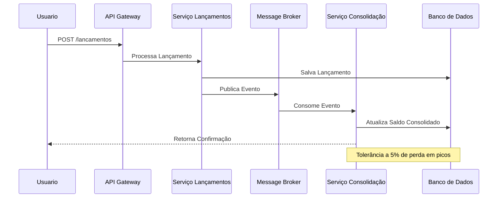

```mermaid
sequenceDiagram
    participant U as Usuario
    participant AG as API Gateway
    participant LS as Serviço Lançamentos
    participant MB as Message Broker
    participant CS as Serviço Consolidação
    participant DB as Banco de Dados

    U->>AG: POST /lancamentos
    AG->>LS: Processa Lançamento
    LS->>DB: Salva Lançamento
    LS->>MB: Publica Evento
    MB->>CS: Consome Evento
    CS->>DB: Atualiza Saldo Consolidado
    CS-->>U: Retorna Confirmação
    
    Note over CS,DB: Tolerância a 5% de perda em picos
```
